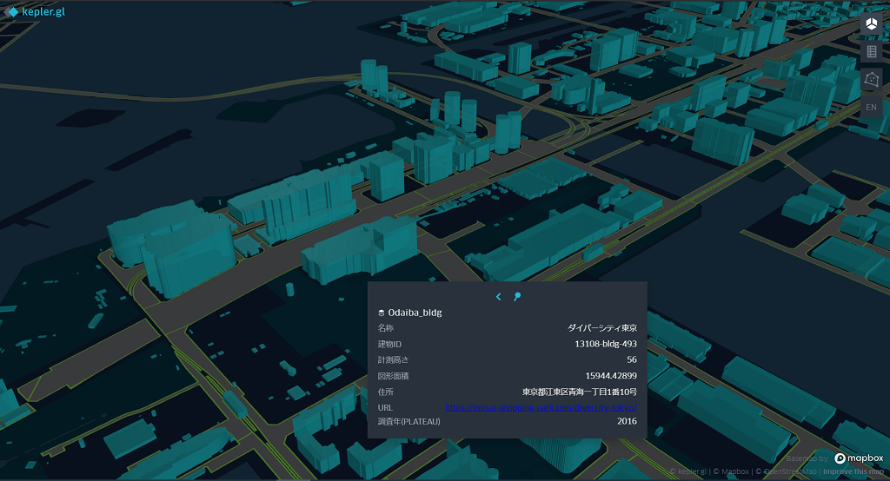
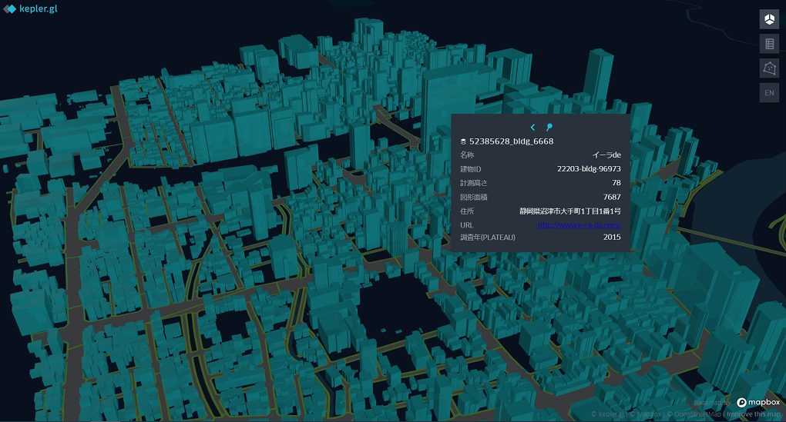

# plateau-geo-tools

国土交通省が整備を進めている[Project PLATEAU](https://www.mlit.go.jp/plateau/)で配布されているCityGML形式のデータをGeoJSONなどのGISファイルフォーマットに変換したり、情報を補完するためのツールです。

<br/>

## デモ
[kepler.gl](https://kepler.gl/)を使用して表示を行っています。  
※ デモ用のデータでは、開発中の機能であるDBPedia Japaneseから属性情報の補完まで行っています。  
### 東京都・お台場周辺
[デモページ](https://raokiey.github.io/plateau-geo-tools/odaiba.html)  

   

__使用したデータ（出典）__  
- [3D都市モデル（Project PLATEAU）東京都23区（CityGML 2020年度）](https://www.geospatial.jp/ckan/dataset/plateau-tokyo23ku-citygml-2020)  
- [DBPedia Japanese](http://ja.dbpedia.org/)  

### 静岡県・沼津駅周辺  
[デモページ](https://raokiey.github.io/plateau-geo-tools/numazu.html)  

   

__使用したデータ（出典）__  
- [3D都市モデル（Project PLATEAU）沼津市（2020年度）](https://www.geospatial.jp/ckan/dataset/plateau-22203-numazu-shi-2020)  
- [DBPedia Japanese](http://ja.dbpedia.org/)  

<br/>

## 機能
- Project PLATEAUで配布されているCityGMLデータをGeoJSONなどのGISファイルフォーマットに変換する  
    ジオメトリ情報は屋根外形 (bldg:lod0RoofEdge) の情報を元に生成することを想定しています。  

- 図形面積の情報を補完する  
    図形面積（uro:buildingRoofEdgeArea ）の情報が0の場合、ポリゴンの面積を求め情報を補完しています。  
    単位は`平方メートル`です。
    精度が保証できないため、小数ではなく整数値としています。    

<br/>

## 注意事項  
- __あくまで個人が趣味で開発したものです__  
- [G空間情報センターのページ](https://www.geospatial.jp/ckan/dataset/plateau)から配布されているすべてのCityGMLデータの仕様を満たすものではありません  
- このツールを利用したことによって生じたいかなる損害についても、ツール作成者は責任を負いかねます  
<br/>

## 動作環境
Python3（Python 3.9.6, Ubuntu20.04 LTSで動作確認）

<br/>

## 使い方  
### 環境構築  
condaで仮想環境を構築することを想定しています。  

```shell
$ conda env create -n ${環境名} -f environment.yml
```  
  
<br/>

### GISファイルフォーマットへの変換（convert_gis_format.py）

__使い方__

```shell
$ python convert_gis_format.py ${module} ${gml_path} ${save_dir} --cfg_path ${cfg_path} --save_format ${save_format}
```

__引数の説明__  
|引数名|型|説明|備考|
|:--|:--:|:--|:--|
|module|str|モジュールの名前空間|必須引数<br/> 建物の場合は`bldg`<br/> 道路の場合は`tran`|
|gml_path|str|変換対象のCityGMLデータのパス|必須引数|
|save_dir|str|保存先ディレクトリのパス|必須引数|
|cfg_path|str|設定ファイルのパス|オプション引数<br/>デフォルトは`config`ディレクトリ以下のファイル|
|save_format|str|保存フォーマット|オプション引数<br/> デフォルトは`GeoJSON`|  

※ 保存フォーマットについて  
以下の通りに指定してください。  
|フォーマット|指定する文字列|
|:--|:--|
|GeoJSON|GeoJSON|
|ESRI Shapefile|shp|
|GeoPackage|gpkg|  


__例1) 建物データをGeoPackage形式に変換__  

```shell
$ python convert_gis_format.py bldg ${gml_path} ${save_dir} --save_format gpkg
```

__例2) 道路データをGeoJSON形式に変換__  

```shell
$ python convert_gis_format.py tran ${gml_path} ${save_dir}
```

<br/>

### 図形面積の補完（supplement_area.py）

__使い方__

```shell
$ python supplement_area.py ${target_path} ${save_dir} ${cfg_path} --field_name ${field_name} --save_format ${save_format}
```

__引数の説明__  
|引数名|型|説明|備考|
|:--|:--:|:--|:--|
|target_path|str|変換対象のファイルのパス|必須引数|
|save_dir|str|保存先ディレクトリのパス|必須引数|
|cfg_path|str|GISファイルフォーマット変換時に使用した設定ファイルのパス|必須引数<br/> 変換時に指定していない場合は`config` ディレクトリ以下にあるyamlファイルを指定する|
|field_name|str|図形面積が格納されているフィールド名|オプション引数<br/> デフォルトは`図形面積` <br/> 図形面積を格納しているフィールドが無い場合は`None` を指定する|
|save_format|str|保存フォーマット|オプション引数<br/> デフォルトは`GeoJSON`|  

※ 保存フォーマットについて  
GISファイルフォーマットへ変換の箇所と同様。  

__例1) デフォルト__  

```shell
$ python supplement_area.py ${target_path} ${save_dir} ./config/building_config.yml
```

__例2) 図形面積に当たる情報が無い場合__  

```shell
$ python supplement_area.py ${target_path} ${save_dir} ./config/building_config.yml --filed_name None
```

<br/>

## 今後の予定  
- [ ] ベクタータイル（MVTフォーマット）への変換
- [ ] DBpedia Japaneseから属性情報を補完する機能の追加    
- [ ] dem（地形）モジュールの変換スクリプトの実装  
- [ ] 3D GISデータへの対応  
- [ ] Open Street MapなどDBpedia Japanese以外のオープンデータから属性情報の補完  

<br/>

## 更新履歴  
|更新日|更新内容|  
|:---|:---|  
|2021/08/01|初版公開|  
